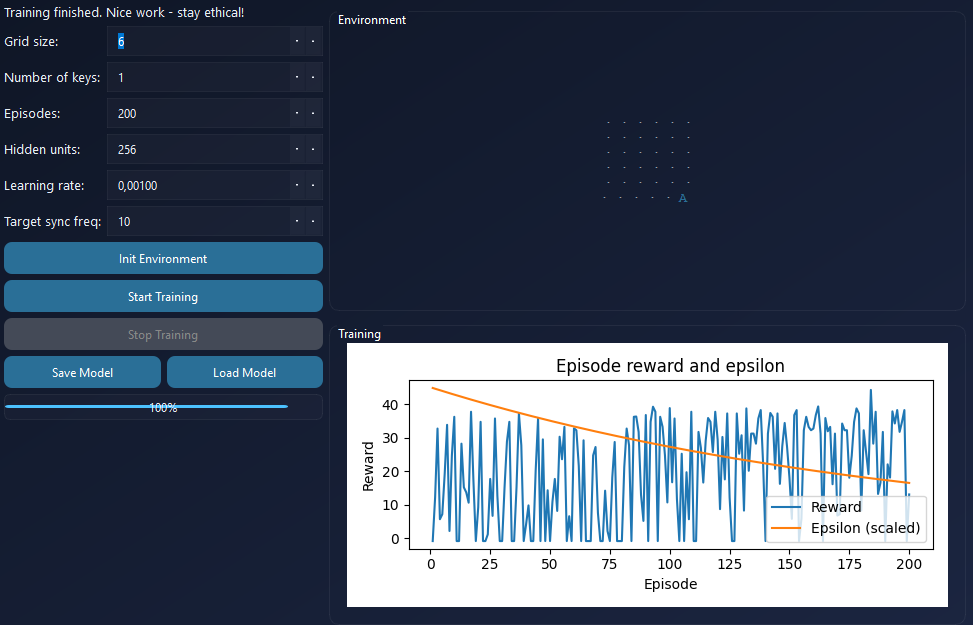

# VulnRL Trainer

VulnRL Trainer is an educational application that demonstrates Reinforcement Learning (RL) in a safe, simulated environment. This tool is designed for learning and experimenting with RL algorithms on a simple grid world, with a focus on ethical use and educational purposes.

---

## Contents

- [Overview](#overview)  
- [Features](#features)  
- [Installation](#installation)  
- [Running](#running)  
- [Usage](#usage)  
- [Educational Purpose](#educational-purpose)  
- [License](#license)  

---

## ScreenShot


## Icon


## Overview

Grid Environment:
- The agent starts at the top-left corner.  
- The goal is at the bottom-right corner and the agent must collect all keys.  
- Actions: up, right, down, left.  
- Observation: flattened grid state matrix.  

The RL agent uses **Deep Q-Network (DQN)** with a Replay Buffer and a target network. Hyperparameters like network size, learning rate, and target sync frequency can be adjusted.

---

## Features

- Initialize and visualize the grid environment.  
- Train a DQN agent with graphical reward per episode and epsilon display.  
- Adjustable hyperparameters: grid size, number of keys, episodes, hidden layers, learning rate, target sync frequency.  
- Save and load trained models.  
- Display current environment state in GUI with visual cues for agent, keys, and goal.  
- Ethical prompt: user must confirm that the tool is used legally and educationally.  
- Advanced visualization: reward plot, epsilon decay, interactive progress updates.

---

## Installation

1. Clone the repository or download the files.  
2. Install required Python packages:

```bash
pip install pyqt6 torch matplotlib numpy
Run the application using Python 3.9 or later:

bash

python vulnrl_trainer.py
Running
On first launch, a Consent Dialog will appear requiring you to type I AGREE to proceed.

After accepting, the GUI opens.

Adjust parameters: grid size, number of keys, episodes, hidden layers, learning rate, and target sync frequency.

Click Init Environment to create the grid.

Click Start Training to begin training the agent.

During training, the GUI displays the grid state and reward plot per episode.

After training, you can save or load models.

Usage
Init Environment: sets up the grid with chosen parameters.

Start Training: runs DQN training with current parameters.

Stop Training: stops the ongoing training.

Save Model: saves the current network state as a .pt file.

Load Model: loads a previously saved model.

Plot: displays reward per episode and epsilon decay.

Educational Purpose
The application is intended for safe and ethical RL learning.

Demonstrates core concepts of Deep Q-Networks, Replay Buffers, and epsilon-greedy policies.

Visualization helps understand how the agent learns and how Q-values evolve during training.

Not intended for real-world system exploitation or any illegal activities.

License
This project is open-source and may only be used for educational and research purposes. The author is not responsible for unethical or illegal use of this tool.
